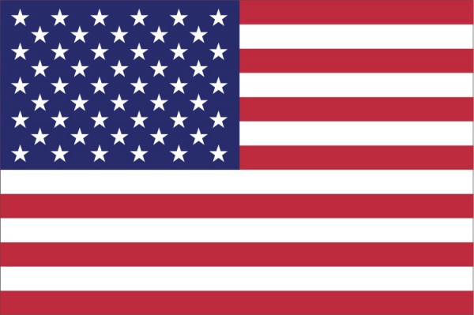
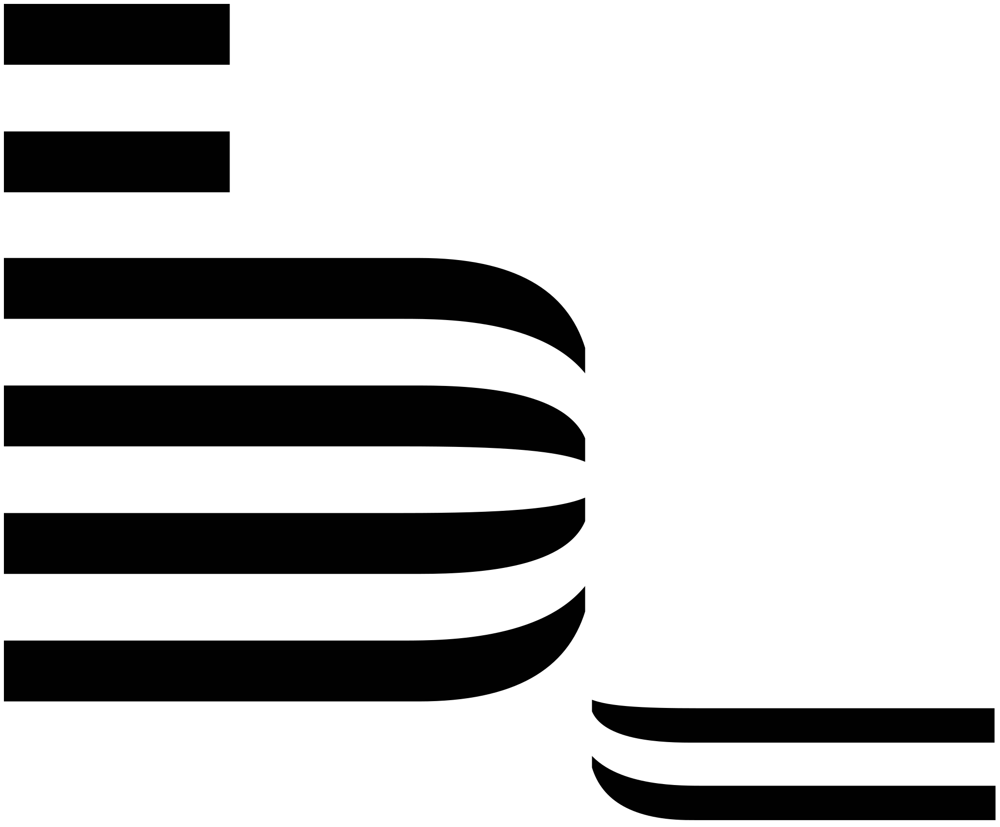
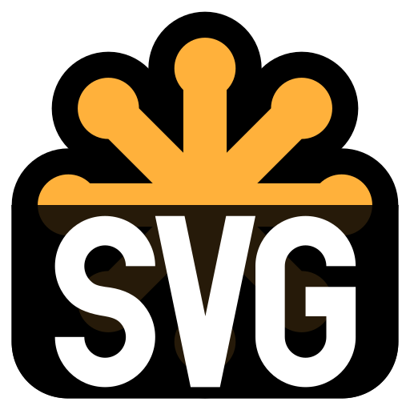

<h1 align="center">Hallo, ich bin <a href="https://github.com/lordponchik" target="_blank">Denys</a></h1>

  <h3>📖 Über mich : </h3>
🧠 Derzeit mache ich eine Umschulung zum Fachinformatiker Anwendungsentwickler bei <a href="https://www.lutzundgrub.de/"><b>LUTZ + GRUB</b></a> und suche ein <b>Praktikum</b>.

🤓 Ich habe 2023 einen Online-Kurs an der ukrainischen <a href="https://goit.global/ua/"><b>GoIT</b></a> Schule im Bereich Frontend-Entwicklung abgeschlossen.

<h3>🌍 Meine Sprachen :</h3>

<table style="display: flex; align-items: flex-start; align: center;">
	<tbody>
		<tr>
			<td></td>
			<td>Deutsch (B2)</td>
			<td rowspan="4"></td>
		</tr>
		<tr>
			<td></td>
			<td>Englisch (A1)</td>
		</tr>
		<tr>
			<td></td>
			<td>Ukrainisch (Muttersprache)</td>
		</tr>
		<tr>
			<td></td>
			<td>Russisch (Muttersprache)</td>
		</tr>
	</tbody>
</table>

---

  
<h3>🔨 Mein Stack und meine Tools :</h3>

<table>
  <tr>
     <td align="center"  width="90">
         
       HTML5
    </td>
    <td align="center" width="90">
        
       CSS3
    </td>
    <td align="center" width="90">
         
       JavaScript
    </td>
    <td align="center" width="90">
        
       BEM
    </td>
    <td align="center" width="90">
        
       SASS
    </td>
    <td align="center" width="90">
        
       Git
    </td>
        <td align="center" width="90">
        
       Parcel
    </td>
  </tr>
  <tr>
    <td align="center" width="90">
      
       NPM
    </td>
        <td align="center" width="90">
       
       SVG
      </td>
    <td align="center" width="90">
        
       VSCode
    </td>      
  <td align="center" width="90">
        
       Figma
     </td>
    <td align="center" width="90">
        
       TypeScript
    </td>
    <td align="center" width="90">
        
       React.js
    </td>
    </tr>
</table>

---
  

 <h3>🚀 Roadmap 2024 :</h3>

✍️ - **Verbessern:** `Deutsch` | `HTML5` | `CSS3` | `JavaScript`  
📚 - **Lernen:** `React.js` | `TypeScript` | ~`Node.js`~  

<h3>🚀 Roadmap 2025 :</h3> 

✍️ - **Verbessern:** `Deutsch` | `HTML5` | `CSS3` | `JavaScript` | `React.js` | `TypeScript`  
📚 - **Lernen:** `C#` | `Python` | `SQL`  

---

 <h3>📊 Statistik :</h3>

  

---
